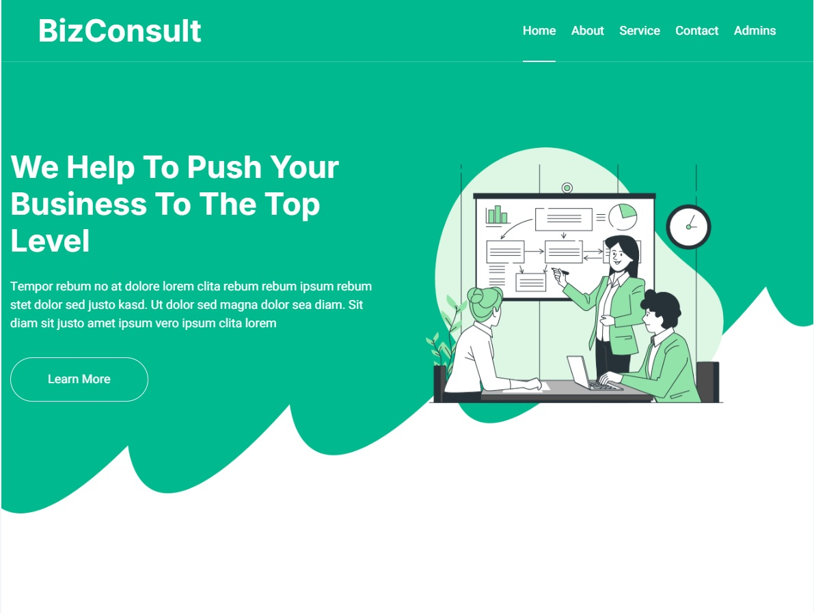
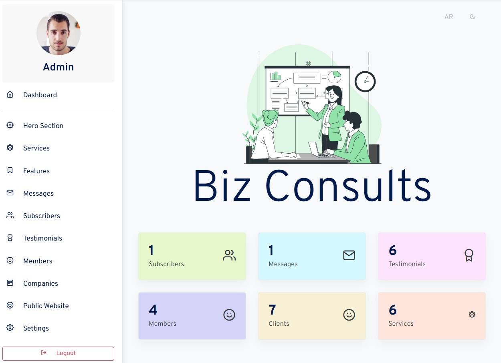

# BizConsult CMS

A Laravel-powered content management system (CMS) for a consultancy public website — a learning project built with Laravel 10 to manage public-facing content, provide multilingual support, and offer a full-featured admin dashboard.

---

[](#license) [](#tech-stack) [](#tech-stack)

## Overview

BizConsult CMS is a learning & demo project created during the "Laravel For Absolute Beginners 2024 – Level 2" course by Eng. Mahmoud Anwar. Its purpose is to demonstrate how to build and manage a public-facing consultancy website using Laravel 10 with a polished front-end, multilingual support, and an admin dashboard for managing services, features, testimonials, and other business sections.

This repository is intended for learning and skill-development and is not recommended for production use.

---

## Key Features

Public website (frontend)
- Hero / landing section
- Services section
- Features section
- Testimonials
- Contact form (messages stored in DB)
- Newsletter subscription (subscribers stored in DB)
- Multi-language support via mcamara/laravel-localization
- Font Awesome icons and Bootstrap-based styling using the BizConsult website template

Admin dashboard (TinyDash)
- Full CRUD (create, read, update, delete) for:
  - Services
  - Features
  - Testimonials
  - Companies
  - Members
- Data extraction / management:
  - Users' messages (contact form) — list & view
  - Subscribers list
- Admin utilities:
  - Dashboard statistics (home)
  - Basic settings page
  - Admin authentication (Laravel Breeze)
  - Language switching for admin & public site

---

## Tech stack

| Layer            | Technology / Package                           |
|------------------|------------------------------------------------|
| Backend          | Laravel 10, PHP 8.1+                           |
| Authentication   | Laravel Breeze                                 |
| Frontend         | Blade templates, Bootstrap                     |
| Dashboard UI     | TinyDash (admin template)                      |
| Website UI       | BizConsult 1.0.0 (public website template)     |
| Localization     | mcamara/laravel-localization                   |
| Database         | MySQL (MySQL 5.7+ / MariaDB 10+)               |
| Icons            | Font Awesome 5                                 |


---

## Project status

This repository is a learning and skill-development project created during Laravel studies and is not intended for production use.

---

## Project screenshots

Frontend website

Backend website


---

## Getting Started (Installation Guide)

Follow these steps to install and run BizConsult CMS locally.

Prerequisites

- PHP 8.1+
- Composer
- MySQL (or MariaDB)
- Node.js & npm (for asset building)
- Git (recommended)
- Recommended environments: Laravel Valet, XAMPP, Laragon, WAMP, or Docker

1) Clone the repository
```bash
git clone https://github.com/Islam-Abdelraouf/biz-consult-Laravel-intermediate.git
cd bizconsult-cms
```

2) Run Packages and helpers

You have to all used packages and load helpers as below.

```bash
composer install
npm install
npm run dev
npm run build
```

3) Example .env database snippet (update with your values):
```env
APP_NAME=BizConsult
APP_ENV=local
APP_KEY=base64:...
APP_DEBUG=true
APP_URL=http://localhost:8000

DB_CONNECTION=mysql
DB_HOST=127.0.0.1
DB_PORT=3306
DB_DATABASE=biz_consult
DB_USERNAME=root
DB_PASSWORD=
```

4) Create the database (if not already created):
```sql

CREATE DATABASE biz_consult;
```

5) Run migrations & seeders
```bash

php artisan migrate --seed
# or run seeders manually:
php artisan db:seed
```

6) Serve the application
```bash

php artisan serve
# Visit: http://localhost:8000
```

7) Accessing Admin Panel

You can access admin login page using this url.

```
http://localhost:8000/admin
```

## Development & Contribution

This is primarily a learning project, but contributions are welcome. If you'd like enhancements, documentation updates, or screenshots added:

- Open an issue describing the change you'd like.
- For code contributions: fork the repo, create a feature branch, implement changes, and open a pull request with a clear description of what you changed and why.

---

## Credits

- Course: <a href="https://www.udemy.com/course-dashboard-redirect/?course_id=5896146">"Laravel For Absolute Beginners 2024 – Level 2"</a> by Eng. Mahmoud Anwar
- Templates:
  - TinyDash (dashboard)
  - BizConsult 1.0.0 (public website template)
- Localization: mcamara/laravel-localization
- Icons: Font Awesome 5

---

